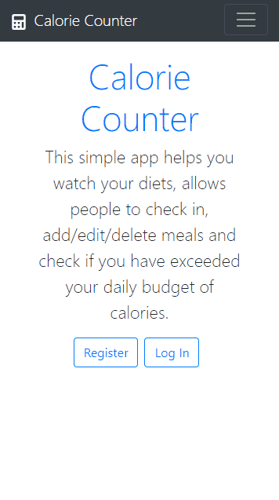

# Calorie Counter

This is an app that helps you count your daily calorie intake. Built with React and Firebase.

## Features

 - User can create an account and log in.
 - When logged in, a user can see a list of his meals, also he can add, edit and delete meals. 
 - three roles with different permission levels: a regular user would only be able to CRUD on their owned records, a user manager would be able to CRUD users, and an admin would be able to CRUD all records and users.
 - Each meal entry has a date, time, text, and num of calories.
 - Filter by dates from-to, time from-to (e.g. how much calories have I had for lunch each day in the last month if lunch is between 12 and 15h).
 - User setting – Expected number of calories per day.
 - When meals are displayed, they go green if the total for that day is less than expected number of calories per day, otherwise they go red.

## How to run

- Download this app 
- run 'cd calories' then 'npm install'
- run 'npm start' 

